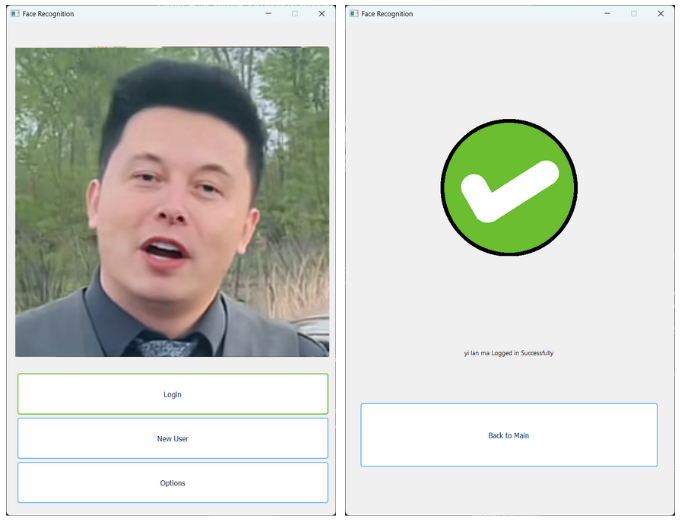
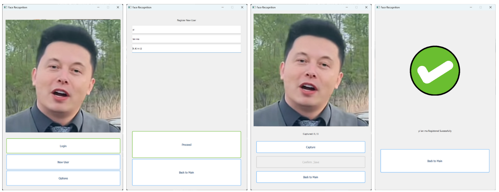
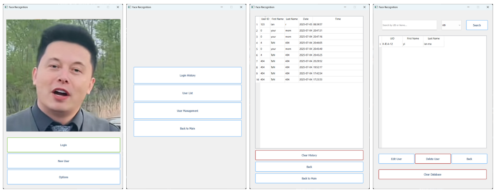

#  Face Recognition Attendance System

A modern desktop attendance system built using **PyQt5** with real-time face recognition powered by **InsightFace** and `onnxruntime`. The app follows the **MVP (Model-View-Presenter)** architecture for clean code separation, and supports and smooth multi-page navigation.

---

## Features

- **Live webcam feed** for registration and recognition
- **Face registration** with 3-image capture and embedding
- **Face recognition** using `insightface` (ONNX model)
- **Automatic attendance logging** (with date & time)


---

## 📁 Project Structure (MVP)

```bash

Face-Recognition/
├── main.py # Entry point
├── models/ # Database + logic layer
│ └── user_model.py
├── presenters/ # Business logic per screen
│ └── home_presenter.py
│ └── capture_presenter.py
│ └── register_presenter.py
├── views/ # PyQt5 UI classes
│ └── home_view.py
│ └── capture_view.py
│ └── register_view.py
├── ui/ # Helpers (theme manager, etc.)
│ └── theme_manager.py
├── assets/ # App icons, images, etc.
├── data/ # SQLite DB file & schema
│ └── face-recognition-db.db
├── requirements.txt
└── README.md

```

## 🛠 Installation

```bash
git clone https://github.com/TaN-404/Face-Recognition.git
cd Face-Recognition
python -m venv env
env\Scripts\activate          # Windows
# OR
source env/bin/activate       # macOS/Linux

pip install -r requirements.txt
python main.py

```

## Sample Screenshots






## Future Improvements

- Admin login

- Attendance report export (CSV, PDF)

- Liveness detection / anti-spoofing

- Multi-language support

## License

This project is licensed under the [CC BY-NC 4.0](https://creativecommons.org/licenses/by-nc/4.0/) license.  
**Commercial use is prohibited** without the author's permission.
